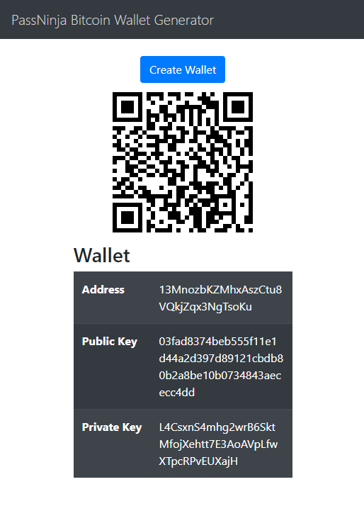

## Passninja

Hi, welcome to the Passninja coding challenge. This challenge is meant to give us an understanding of your capabilities using the technologies we use to build our applications. The subject matter (bitcoin) is unrelated to what we do on a daily basis, so don't worry if you don't have a deep understanding of it (you won't need it beyond this challenge).

**MAKE SURE YOU READ EVERYTHING BEFORE YOU START WRITING CODE**

## The Challenge

We're going to be building a Node.JS API endpoint that creates a bitcoin wallet, writing tests and deploying it on AWS lambda.

We'll also have a front end portion that uses the lambda endpoint to create a wallet that will be deployed/uploaded to S3.

You will have up to 4 hours to complete this, but we do not expect it to take that long. *It is OKAY if you do not complete every item*. Also you should make sure to create a branch for your work.

Here is your rubric for the NodeJS portion (to be completed in order):

- [X] Create a NodeJS app with a single endpoint for creating a bitcoin wallet (any kind is OK)
- [-] Write a test against your single endpoint
- [X] Adapt the NodeJS app to AWS Lambda
- [-] Deploy the app to AWS lambda
- [-] Update README.md on your branch to have a link to the endpoint

Here is your rubric for the front end portion:

- [X] Has a button to create a wallet
- [-] Makes an AJAX request to the AWS lambda endpoint referenced above
- [X] Shows the Wallet Private Key
- [X] Shows the wallet QR code using it's public address
- [X] Displays properly on a mobile device
- [X] Deploy front end to AWS S3
- [X] Update README.md on your branch to have a link to the webpage on S3
- [X] http://passninja-frontend.s3-website.us-east-2.amazonaws.com/
  

**Branching and File Structure**
> You must create a branch that is the same name as your GitHub username - that is where you will do all of your work. Also, put all of the files for the NodeJS portion in the folder titled `lambda_files` and all of the files for the front end portion in the folder titled `s3_files`.

## Additional resources

You are not restricted to pure NodeJS, you can use [express.js](https://expressjs.com/).

If you use express, [this tutorial](https://medium.freecodecamp.org/express-js-and-aws-lambda-a-serverless-love-story-7c77ba0eaa35) may be helpful for getting it on AWS. 

If you don't use express [here is a tutorial on deploying NodeJS apps to Lambda](https://docs.aws.amazon.com/lambda/latest/dg/programming-model.html).

You will also need to use [BitcoinJS](https://github.com/bitcoinjs/bitcoinjs-lib) to make wallet creation easy.

For the frontend we'd prefer if you used [Angular JS](https://angular.io/), however feel free to use [Vue](https://vuejs.org/) or [React](https://reactjs.org/) if that is more your speed.

[Here is a good resource](https://css-tricks.com/snippets/css/media-queries-for-standard-devices/) for making mobile responsive web apps.

Don't hesitate to send any questions to richard@flomio.com!
